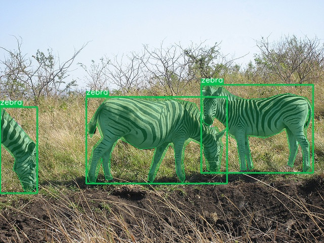
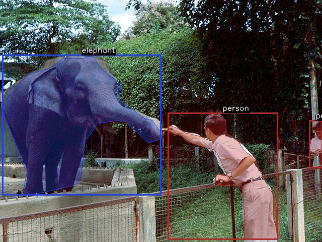

# DataFlow-CV

> 🌊 **Everything your model doesn't do.** Analyse, convert, visualize, evaluate — a single CLI for all CV data.

<p align="center">
  <a href="https://pypi.org/project/dataflow-cv/"></a>
  <a href="https://www.python.org/downloads/"></a>
  <a href="https://github.com/zjykzj/DataFlow-CV/actions/workflows/python-publish.yml"></a>
  <a href="LICENSE"></a>
  <a href="https://deepwiki.com/zjykzj/DataFlow-CV"></a>
  <br>
  
  
  
  
  
  
</p>

A computer vision dataset processing library — analyse, convert, visualize, and evaluate annotations across YOLO, LabelMe, and COCO formats.

| | | |
|:---|:---|:---|
| 🔍 **Analyse** | Stats, train/val split, category filter, N-way partition & file sampling — format auto-detection | `dataflow-cv analyse stats ...` |
| 🔄 **Convert** | 6 directions: YOLO ↔ LabelMe ↔ COCO, plus model predictions | `dataflow-cv convert yolo2coco ...` |
| 🎨 **Visualize** | OpenCV rendering with color-coded classes, display & save modes | `dataflow-cv visualize yolo ...` |
| 📊 **Evaluate** | COCO mAP via pycocotools, single-threshold P/R/F1 per class | `dataflow-cv evaluate detection ...` |
| 💻 **CLI + API** | Click-based CLI with rich `--help`; Python API for pipelines | `from dataflow.convert import ...` |

---

## 📦 Installation

```bash
pip install dataflow-cv               # from PyPI
pip install dataflow-cv[coco]         # optional: COCO RLE + evaluation
```

Or from source:

```bash
git clone https://github.com/zjykzj/DataFlow-CV.git
cd DataFlow-CV && pip install .
```

---

## 🚀 Quick Start

### Command-line Interface

All required parameters (image directories, label directories, class files, output paths) are positional arguments for better usability. Use `--help` on any subcommand for detailed usage.

#### 🔍 Dataset Analysis

```bash
# Dataset statistics (auto-detects YOLO / LabelMe / COCO)
dataflow-cv analyse stats yolo_labels/ --image-dir images/ --class-file classes.txt
dataflow-cv analyse stats labelme_json/
dataflow-cv analyse stats coco_annotations.json

# Train / test split (YOLO / LabelMe only — labels / images / both modes)
dataflow-cv analyse split -l yolo_labels/ outputs/ --ratio 0.8 --seed 42 -c classes.txt
dataflow-cv analyse split -i images/ outputs/ --ratio 0.8
dataflow-cv analyse split -l yolo_labels/ -i images/ outputs/ --ratio 0.8

# Category filter (keep a subset of categories, remap IDs per new classes.txt)
dataflow-cv analyse filter yolo_labels/ classes.txt classes_new.txt filtered/
dataflow-cv analyse filter coco_annotations.json classes.txt classes_new.txt filtered/

# N-way partition — YOLO / LabelMe only (labels drive, images follow by stem)
dataflow-cv analyse partition -n 4 --label-dir yolo_labels/ --image-dir images/ parts/
dataflow-cv analyse partition -n 4 --image-dir images/ --shuffle parts/

# File sampling — collect N files (random or sequential, labels / images / both modes)
dataflow-cv analyse sample -l yolo_labels/ output/ -n 10
dataflow-cv analyse sample -i images/ output/ -n 10 --no-shuffle
dataflow-cv analyse sample -l yolo_labels/ -i images/ output/ -n 5 --seed 42

# Sort by count descending (default: class ID ascending)
dataflow-cv analyse stats --sort-by count --descending yolo_labels/

# Verbose logging
dataflow-cv analyse stats --verbose yolo_labels/ --class-file classes.txt
```

#### 🔄 Format Conversion

```bash
# YOLO → COCO
dataflow-cv convert yolo2coco images/ yolo_labels/ classes.txt output.json

# YOLO → COCO (with RLE encoding)
dataflow-cv convert yolo2coco images/ yolo_labels/ classes.txt output.json --do-rle

# YOLO → LabelMe
dataflow-cv convert yolo2labelme images/ yolo_labels/ classes.txt labelme_json/

# LabelMe → YOLO
dataflow-cv convert labelme2yolo labelme_json/ classes.txt yolo_labels/

# LabelMe → COCO
dataflow-cv convert labelme2coco labelme_json/ classes.txt output.json

# COCO → YOLO
dataflow-cv convert coco2yolo input.json yolo_labels/

# COCO → LabelMe
dataflow-cv convert coco2labelme input.json labelme_json/

# YOLO predictions → COCO (output: plain JSON list — prediction format)
dataflow-cv convert yolo2coco --prediction images/ yolo_preds/ classes.txt pred.json

# Options
dataflow-cv convert yolo2coco --verbose images/ labels/ classes.txt output.json
dataflow-cv convert yolo2coco --no-strict images/ labels/ classes.txt output.json
```

#### 🎨 Visualization

```bash
# Visualize YOLO annotations
dataflow-cv visualize yolo images/ yolo_labels/ classes.txt --save visualized/

# Visualize LabelMe annotations
dataflow-cv visualize labelme images/ labelme_json/ --save visualized/

# Visualize COCO annotations
dataflow-cv visualize coco images/ coco_annotations.json --save visualized/

# Verbose logging + headless mode
dataflow-cv visualize yolo --verbose --no-display images/ yolo_labels/ classes.txt --save visualized/
```

<p align="center">
  
  
</p>

#### 📊 Evaluation

Evaluate object detection and instance segmentation models with COCO-standard metrics. Two COCO-format JSON files are required:

| File | Role | Format | How to create |
|------|------|--------|---------------|
| **`anno.json`** | Ground Truth (GT) | Full COCO dict (`images`, `annotations`, `categories`) | `yolo2coco` (label mode) |
| **`pred.json`** | Detection (DT) | Plain JSON list (with `score`) | `yolo2coco --prediction` |

##### ① Prepare Data

```bash
# GT: YOLO labels → COCO
dataflow-cv convert yolo2coco images/ yolo_labels/ classes.txt anno.json

# DT: YOLO predictions → COCO (add --prediction for model output)
dataflow-cv convert yolo2coco --prediction images/ yolo_preds/ classes.txt pred.json
```

> ⚠️ `--prediction` is required for YOLO prediction files — they have an extra `confidence` token per line. The flag outputs a **plain JSON list** (not a full COCO dict), which is the standard DT format for `loadRes()`. Only `yolo2coco` supports `--prediction`; `labelme2coco` does not need it (LabelMe has no label vs prediction distinction).

##### ② Run Evaluation

```bash
# Object detection (bbox IoU)
dataflow-cv evaluate detection anno.json pred.json
dataflow-cv evaluate detection --verbose anno.json pred.json           # per-class breakdown
dataflow-cv evaluate detection --prf1 anno.json pred.json              # P/R/F1 only (skip mAP)
dataflow-cv evaluate detection --prf1 --prf1-iou 0.75 --prf1-method micro anno.json pred.json

# Instance segmentation (mask IoU)
dataflow-cv evaluate segmentation anno.json pred.json
dataflow-cv evaluate segmentation --verbose anno.json pred.json

# Save results as JSON
dataflow-cv evaluate detection --output results.json anno.json pred.json

# Custom log directory
dataflow-cv evaluate detection --verbose --log-dir logs/eval/ anno.json pred.json
```

##### ③ Detection vs Segmentation

Two evaluation modes, distinguished by how overlap is measured:

- **Object Detection** — bounding box IoU. GT and DT require `bbox`; DT additionally requires `score`.
- **Instance Segmentation** — mask IoU. GT and DT require `bbox`, `segmentation` (polygon or RLE), and `area`; DT additionally requires `score`.

`yolo2coco` (label mode) and `yolo2coco --prediction` (prediction mode) automatically populate all required fields for both modes — no manual editing needed.

### 🐍 Python API

```python
from dataflow.util.logging import LogConfig
from dataflow.analyse import StatsAnalyser, SplitAnalyser, FilterAnalyser, PartitionAnalyser, SampleAnalyser
from dataflow.convert import YoloAndCocoConverter
from dataflow.visualize import YOLOVisualizer
from dataflow.evaluate import DetectionEvaluator, compute_pr_f1

# ── Analyse ─────────────────────────────────────────
log_cfg = LogConfig(name="analyse", verbose=True)

# Dataset statistics
analyser = StatsAnalyser(log_config=log_cfg)
result = analyser.analyse("yolo_labels/", class_file="classes.txt")
print(f"{result.data.total_files} images, {result.data.total_annotations} objects")

# Train/test split (YOLO / LabelMe)
splitter = SplitAnalyser(log_config=log_cfg)
result = splitter.analyse(
    output_dir="output/", ratio=0.8, seed=42,
    label_dir="yolo_labels/", class_file="classes.txt",
)
print(f"Train: {result.data.train_count}, Val: {result.data.val_count}")

# Split with images (both mode — labels drive, images follow by stem)
result = splitter.analyse(
    output_dir="output/", ratio=0.8, seed=42,
    label_dir="yolo_labels/", image_dir="images/",
    class_file="classes.txt",
)

# Category filter (keep / remap categories per new classes.txt)
filterer = FilterAnalyser(log_config=log_cfg)
result = filterer.analyse(
    "yolo_labels/", original_class_file="classes.txt",
    new_class_file="classes_new.txt", output_dir="filtered/",
)

# N-way partition (YOLO / LabelMe labels; images follow by stem)
partitioner = PartitionAnalyser(log_config=log_cfg)
result = partitioner.analyse(
    output_dir="parts/", num=4,
    label_dir="yolo_labels/", image_dir="images/",
)

# File sampling (labels, images, or both — random or sequential)
sampler = SampleAnalyser(log_config=log_cfg)
result = sampler.analyse(
    output_dir="sampled/", count=10,
    label_dir="yolo_labels/", shuffle=True, seed=42,
)

# ── Convert ──────────────────────────────────────────
# YOLO labels → COCO (label mode)
log_cfg = LogConfig(name="convert", verbose=True)
converter = YoloAndCocoConverter(source_to_target=True, log_config=log_cfg, strict_mode=True)
result = converter.convert(
    source_path="yolo_labels/", target_path="anno.json",
    class_file="classes.txt", image_dir="images/",
)

# YOLO predictions → COCO (prediction mode)
converter = YoloAndCocoConverter(source_to_target=True, prediction=True)
result = converter.convert(
    source_path="yolo_preds/", target_path="pred.json",
    class_file="classes.txt", image_dir="images/",
)

# ── Visualize ────────────────────────────────────────
visualizer = YOLOVisualizer(
    label_dir="yolo_labels/", image_dir="images/",
    class_file="classes.txt", is_show=True, is_save=True,
    output_dir="visualized/", log_config=log_cfg,
)
result = visualizer.visualize()

# ── Evaluate ─────────────────────────────────────────
evaluator = DetectionEvaluator(log_config=LogConfig(name="eval", verbose=True))
result = evaluator.evaluate("anno.json", "pred.json")
print(f"AP: {result.metrics.ap:.3f}, AP50: {result.metrics.ap50:.3f}")

# Quick P/R/F1 at IoU=0.5 (default: macro averaging, bbox IoU)
prf1 = compute_pr_f1("anno.json", "pred.json", iou_threshold=0.5)
print(f"Macro F1: {prf1.overall.f1_score:.3f}")

# Micro averaging P/R/F1 (samples weighted equally)
prf1 = compute_pr_f1("anno.json", "pred.json", method="micro")
print(f"Micro F1: {prf1.overall.f1_score:.3f}")

# Segmentation P/R/F1 (mask IoU)
prf1 = compute_pr_f1("anno_segm.json", "pred_segm.json", iou_type="segm")
print(f"Segm F1: {prf1.overall.f1_score:.3f}")
```

> 📂 See the `samples/` directory for complete examples: `samples/analyse/` (statistics & split), `samples/convert/` (6 conversion directions), `samples/visualize/` (YOLO, LabelMe, COCO), `samples/evaluate/` (detection & segmentation), `samples/cli/` (CLI workflows).

---

## 📖 Documentation

| Resource | Description |
|----------|-------------|
| **[CLAUDE.md](CLAUDE.md)** | Architecture overview, development guide, and known gotchas |
| **[CHANGELOG.md](CHANGELOG.md)** | Version history and breaking changes |
| **[specs/evaluate/](specs/evaluate/)** | Evaluation metric contracts — IoU, matching, AP/mAP/AR |
| **[specs/formats/](specs/formats/)** | External format contracts — YOLO, LabelMe, COCO, conversion rules |
| **[specs/modules/](specs/modules/)** | Internal module architecture, interface contracts, dependency constraints |

### 💡 Key Concepts

- **Format-Native Coordinates**: YOLO uses normalized [0,1] center-based coordinates; LabelMe and COCO use absolute pixel top-left. There is no hidden internal normalization — check `DatasetAnnotations.format` to interpret coordinate semantics.
- **Strict Mode** (default): Validation errors raise exceptions immediately. Disable with `--no-strict` (CLI) or `strict_mode=False` (API) to skip invalid annotations and continue.
- **Verbose Logging**: `--verbose` enables per-module file logging via `LogManager` — console shows INFO-level progress, log files capture DEBUG details. All logging is owned by modules; the CLI uses `click.echo()` for terminal output.
- **Headless Support**: Use `--no-display` for servers/Docker — pair with `--save` to render visualization images without a GUI window.
- **Keyboard Shortcuts** (visualization): `←` / `↑` for previous, `→` / `↓` / `Enter` / `Space` for next, `s` to save snapshot, `h` to show hints, `q` / `ESC` to exit. First/last-image boundaries are no-ops. Title bar shows `[N/T]` position.
- **Evaluation**: `--prf1` computes P/R/F1 only (single-threshold, per-class TP/FP/FN) — skips the full COCOeval mAP pipeline for speed. Supports macro/micro averaging and bbox/mask IoU. Run without `--prf1` for standard COCO mAP. For both metrics, run twice.
- **Prediction Files**: YOLO predictions use 6 tokens (detection) or even tokens (segmentation) vs 5/odd for labels. Use `--prediction` with `yolo2coco` — outputs a plain JSON list of annotation dicts compatible with pycocotools `loadRes()`.

---

## 🔧 Development

For detailed developer guidance including advanced test commands, debugging, and architecture overview, see [CLAUDE.md](CLAUDE.md). Optional Claude Code skills for common tasks (`/maestro:spec`, `/maestro:commit`, `/maestro:release`, `/maestro:claude`) are available via the [maestro plugin](https://github.com/zjykzj/claude-skills) — the project develops normally without them.

### 🤖 AI Assistant Skills

Optional Claude Code skills for working with dataflow-cv — `/dataflow:dataflow-cv` (CLI and Python API reference, canonical examples, and known gotchas) — are available via the [dataflow plugin](https://github.com/zjykzj/claude-skills) from the claude-skills marketplace:

```bash
claude plugin install dataflow@claude-skills
```

The skill lets AI assistants operate the dataflow-cv CLI and Python API correctly. The project develops normally without it.

### 🧪 Testing

**561 tests, 80% code coverage (5462 statements).**

```bash
pytest                                    # All tests
pytest --cov=dataflow --cov-report=term   # With coverage
pytest tests/convert/test_yolo_and_coco.py  # Single module
pytest tests/evaluate/test_evaluator.py     # Single module
```

<details>
<summary><b>📊 Coverage by module</b></summary>

| Module | Coverage | Highlights |
|--------|:--------:|------------|
| `dataflow/label/` | 71% | models (84%), base (82%), utils (78%), coco_handler (74%), labelme_handler (71%), yolo_handler (61%) |
| `dataflow/analyse/` | 84% | base (99%), log_templates (92%), sample (87%), utils (85%), split (85%), stats (83%), filter (76%), partition (74%) |
| `dataflow/convert/` | 85% | labelme_and_yolo (93%), yolo_and_coco (89%), utils (87%), coco_and_labelme (86%), base (80%), rle (80%) |
| `dataflow/visualize/` | 81% | yolo_vis (100%), labelme_vis (100%), coco_vis (93%), base (76%) |
| `dataflow/evaluate/` | 87% | evaluator (100%), result (99%), metrics (93%), base (90%), utils (67%) |
| `dataflow/cli/` | 74% | main (96%), visualize cmd (87%), utils (87%), evaluate cmd (83%), analyse cmd (65%), convert cmd (52%) |
| `dataflow/util/` | 100% | logging (100%) |

</details>

### 🎨 Code Quality

```bash
pip install -e .[dev]        # Install dev dependencies
black dataflow tests samples  # Format
isort dataflow tests samples  # Sort imports
mypy dataflow                 # Type check
flake8 dataflow tests samples # Lint
```

### 🔗 Pre-commit Hooks (Optional)

```bash
pip install pre-commit
pre-commit install            # Install git hooks (run once)

# After this, every `git commit` auto-runs:
#   black → isort → flake8 → whitespace checks

pre-commit run --all-files    # Manual run against all files
```

### 📁 Project Structure

```
dataflow/
├── label/           # Annotation handlers + data models
├── analyse/         # Dataset stats, train/val split, category filter, N-way partition, file sampling
├── convert/         # Format converters, RLE utility, log templates
├── visualize/       # OpenCV-based rendering, log templates
├── evaluate/        # pycocotools-based metrics, log templates
├── util/            # Unified logging (LogManager + format helpers)
└── cli/             # CLI entry point, commands, validation
tests/               # Unit & integration tests (561 tests, conftest fixtures)
samples/             # Python API usage examples (analyse, convert, visualize, evaluate, cli)
assets/              # Test data (det/seg by format)
specs/               # Canonical specifications (evaluate/ + formats/ + modules/)
```

---

## 🤝 Contributing

Contributions are welcome! Please review [CLAUDE.md](CLAUDE.md) for architecture and development patterns before contributing.

1. 🍴 Fork the repository
2. 🌿 Create a feature branch
3. ✏️ Make your changes — **spec-first**: if a change affects a contract in [specs/](specs/), update the spec before the code (SDD, see the `/maestro:spec` skill)
4. 🧪 Add or update tests as needed
5. ✅ Ensure code passes formatting and linting checks
6. 📬 Submit a pull request

---

## 📄 License

This project is licensed under the MIT License — see [LICENSE](LICENSE) for details.

---

## 🙏 Acknowledgments

- Thanks to the creators of YOLO, LabelMe, and COCO formats for establishing these annotation standards
- Built with [OpenCV](https://opencv.org/), [NumPy](https://numpy.org/), [Click](https://click.palletsprojects.com/), and [pycocotools](https://github.com/cocodataset/cocoapi)
- Inspired by the need for seamless format conversion in multi-tool CV pipelines
