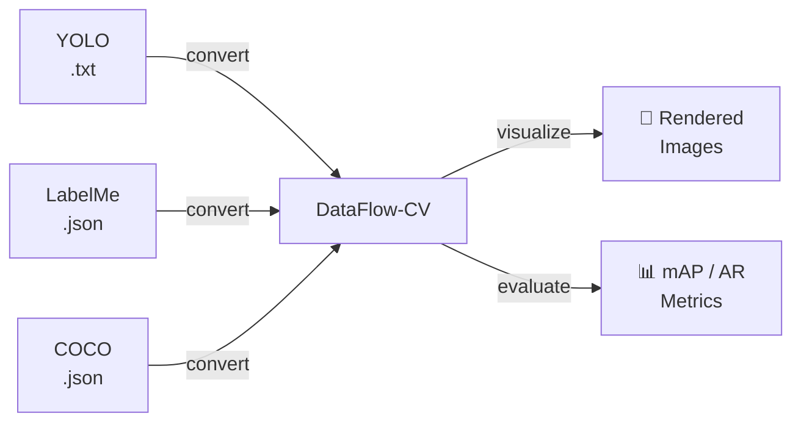

# DataFlow-CV

> 🌊 **Where Vibe Coding meets CV data.** Convert, visualize & evaluate datasets — built with the flow of Claude Code.

<p align="center">
  <a href="https://pypi.org/project/dataflow-cv/"></a>
  <a href="https://www.python.org/downloads/"></a>
  <a href="https://github.com/zjykzj/DataFlow-CV/actions/workflows/python-publish.yml"></a>
  <a href="LICENSE"></a>
  <br>
  
  
  
</p>

A computer vision dataset processing library for seamless format conversion, visualization, and evaluation between YOLO, LabelMe, and COCO annotation formats. Designed for researchers and developers working with multi-format annotation pipelines.



---

## ✨ Features

| | | |
|:---|:---|:---|
| 🔄 **Format Conversion** | Convert between YOLO, LabelMe, and COCO in any direction — 6 conversion paths, plus prediction file support with confidence scores |
| 🎯 **Detection & Segmentation** | Handle both object detection (bbox) and instance segmentation (polygon/RLE) annotations |
| 🎨 **Visualization** | Render annotations with OpenCV — color-coded classes, semi-transparent masks, display & save modes |
| 📊 **Evaluation** | COCO-standard 12-metric output (mAP, AP50, AP75, AR) via pycocotools, with per-class breakdowns |
| 💻 **Command-line Interface** | Intuitive CLI with `convert`, `visualize`, and `evaluate` subcommands — positional args, rich `--help` |
| 🐍 **Python API** | Programmatic access for integration into larger ML pipelines |
| 📝 **Verbose Logging** | File-based debug logging with timestamps — toggle with `--verbose` |
| 🖥️ **Headless Mode** | Server/Docker-friendly: `--no-display` + `--save` for off-screen rendering |
| 🛡️ **Flexible Error Handling** | Strict mode (abort on error) or lenient mode (skip & continue with warnings) via `--no-strict` |

---

## 📦 Installation

### From PyPI

```bash
pip install dataflow-cv
```

### From Source

```bash
git clone https://github.com/zjykzj/DataFlow-CV.git
cd DataFlow-CV

# Regular installation
pip install .

# Editable installation (for development)
pip install -e .
```

> 💡 **Tip**: When installed in editable mode, use `python -m dataflow.cli` instead of the `dataflow-cv` command.

### Optional Dependencies

| Dependency | Purpose | Install |
|-----------|---------|---------|
| `pycocotools` | COCO RLE segmentation + evaluation | `pip install pycocotools` |

---

## 🚀 Quick Start

### Command-line Interface

All required parameters (image directories, label directories, class files, output paths) are positional arguments for better usability. Use `--help` on any subcommand for detailed usage.

#### 🔄 Format Conversion

```bash
# YOLO → COCO
dataflow-cv convert yolo2coco images/ yolo_labels/ classes.txt output.json

# YOLO → COCO (with RLE encoding)
dataflow-cv convert yolo2coco images/ yolo_labels/ classes.txt output.json --do-rle

# YOLO → LabelMe
dataflow-cv convert yolo2labelme images/ yolo_labels/ classes.txt labelme_json/

# LabelMe → YOLO
dataflow-cv convert labelme2yolo labelme_json/ classes.txt yolo_labels/

# LabelMe → COCO
dataflow-cv convert labelme2coco labelme_json/ classes.txt output.json

# COCO → YOLO
dataflow-cv convert coco2yolo input.json yolo_labels/

# COCO → LabelMe
dataflow-cv convert coco2labelme input.json labelme_json/

# YOLO predictions → COCO (with confidence scores)
dataflow-cv convert yolo2coco --prediction images/ yolo_preds/ classes.txt pred.json

# Options
dataflow-cv convert yolo2coco --verbose images/ labels/ classes.txt output.json
dataflow-cv convert yolo2coco --no-strict images/ labels/ classes.txt output.json
```

#### 🎨 Visualization

```bash
# Visualize YOLO annotations
dataflow-cv visualize yolo images/ yolo_labels/ classes.txt --save visualized/

# Visualize LabelMe annotations
dataflow-cv visualize labelme images/ labelme_json/ --save visualized/

# Visualize COCO annotations
dataflow-cv visualize coco images/ coco_annotations.json --save visualized/

# Verbose logging + headless mode
dataflow-cv visualize yolo --verbose --no-display images/ yolo_labels/ classes.txt --save visualized/
```

#### 📊 Evaluation

Evaluate object detection and instance segmentation model outputs using COCO-standard metrics. Two COCO-format JSON files are required:

| File | Role | Source |
|------|------|--------|
| **`anno.json`** | Ground Truth (GT) — reference annotations | `yolo2coco` (label mode) |
| **`pred.json`** | Detection (DT) — model predictions with `score` | `yolo2coco --prediction` |

##### ① Preparing Evaluation Data

If your annotations and predictions are in YOLO format, convert them to COCO JSON first:

```bash
# Step 1: YOLO ground truth labels → COCO GT (anno.json)
#   Label format:   class_id cx cy w h               ← 5 tokens (detection)
#                   class_id x1 y1 ... xn yn          ← odd tokens (segmentation)
dataflow-cv convert yolo2coco images/ yolo_labels/ classes.txt anno.json

# Step 2: YOLO predictions → COCO DT (pred.json)
#   Prediction fmt: class_id cx cy w h confidence     ← 6 tokens (detection)
#                   class_id x1 y1 ... xn yn confidence ← even tokens (segmentation)
dataflow-cv convert yolo2coco --prediction images/ yolo_preds/ classes.txt pred.json
```

> ⚠️ **Important**: YOLO label files (GT) use **odd** token counts, while prediction files (DT) use **even** token counts with a trailing `confidence`. The `--prediction` flag is required for DT — it preserves confidence as the COCO `score` field. Mixed label/prediction files in the same directory are not supported.

##### ② Detection vs Segmentation — Format Requirements

| Field | Detection GT | Detection DT | Segmentation GT | Segmentation DT |
|-------|:-----------:|:-----------:|:---------------:|:---------------:|
| `bbox` | ✅ Required | ✅ Required | ✅ Required (for area) | ✅ Required (for area) |
| `score` | — | ✅ **Required** | — | ✅ **Required** |
| `segmentation` | ❌ Not required | ❌ Not required | ✅ **Required** | ✅ **Required** |
| `area` | ⚪ Recommended | ⚪ Recommended | ✅ **Required** | ✅ **Required** |
| `iscrowd` | ⚪ Optional | — | ⚪ Optional | — |

- **Object Detection** (`iouType='bbox'`): Bounding box overlap evaluation. Only `bbox` + `score` mandatory in DT.
- **Instance Segmentation** (`iouType='segm'`): Mask overlap evaluation. GT and DT must include `segmentation` (polygon or RLE), `area`, and `bbox`.

##### ③ CLI Commands

```bash
# Object detection evaluation (bbox IoU)
dataflow-cv evaluate detection anno.json pred.json

# Verbose per-class breakdown
dataflow-cv evaluate detection --verbose anno.json pred.json

# With P/R/F1 at IoU=0.5
dataflow-cv evaluate detection --prf1 --prf1-iou 0.5 anno.json pred.json

# Instance segmentation evaluation (mask IoU)
dataflow-cv evaluate segmentation anno.json pred.json

# Save results as JSON
dataflow-cv evaluate detection --output results.json anno.json pred.json
```

##### ④ End-to-End Workflow

```bash
# Complete pipeline: YOLO → COCO → Evaluation
dataflow-cv convert yolo2coco images/ yolo_labels/ classes.txt anno.json
dataflow-cv convert yolo2coco --prediction images/ yolo_preds/ classes.txt pred.json
dataflow-cv evaluate detection --verbose --prf1 anno.json pred.json
```

### 🐍 Python API

```python
from dataflow.convert import YoloAndCocoConverter
from dataflow.visualize import YOLOVisualizer
from dataflow.evaluate import DetectionEvaluator, compute_pr_f1

# ── Convert ──────────────────────────────────────────
# YOLO labels → COCO (label mode)
converter = YoloAndCocoConverter(source_to_target=True, verbose=True, strict_mode=True)
result = converter.convert(
    source_path="yolo_labels/", target_path="anno.json",
    class_file="classes.txt", image_dir="images/",
)

# YOLO predictions → COCO (prediction mode)
converter = YoloAndCocoConverter(source_to_target=True, prediction=True)
result = converter.convert(
    source_path="yolo_preds/", target_path="pred.json",
    class_file="classes.txt", image_dir="images/",
)

# ── Visualize ────────────────────────────────────────
visualizer = YOLOVisualizer(
    label_dir="yolo_labels/", image_dir="images/",
    class_file="classes.txt", is_show=True, is_save=True,
    output_dir="visualized/", verbose=True, strict_mode=True,
)
result = visualizer.visualize()

# ── Evaluate ─────────────────────────────────────────
evaluator = DetectionEvaluator(verbose=True)
result = evaluator.evaluate("anno.json", "pred.json")
print(f"AP: {result.metrics.ap:.3f}, AP50: {result.metrics.ap50:.3f}")

# Quick P/R/F1 at IoU=0.5
prf1 = compute_pr_f1("anno.json", "pred.json", iou_threshold=0.5)
print(f"F1: {prf1.overall.f1_score:.3f}")
```

> 📂 See the `samples/` directory for complete examples: `samples/visualize/` (YOLO, LabelMe, COCO demos), `samples/convert/` (conversion examples).

---

## 📖 Documentation

| Resource | Description |
|----------|-------------|
| **[CLAUDE.md](CLAUDE.md)** | Architecture overview, development guide, and known gotchas |
| **[CHANGELOG.md](CHANGELOG.md)** | Version history and breaking changes |
| **[specs/evaluate/](specs/evaluate/)** | Evaluation metric contracts — IoU, matching, AP/mAP/AR |
| **[specs/formats/](specs/formats/)** | External format contracts — YOLO, LabelMe, COCO, conversion rules |
| **[specs/modules/](specs/modules/)** | Internal module architecture, interface contracts, dependency constraints |

### 💡 Key Concepts

- **Format-Native Coordinates**: Coordinates stored in each format's native representation — YOLO normalized [0,1] center-based, LabelMe/COCO absolute pixels top-left. Check `DatasetAnnotations.format` to determine semantics.
- **Explicit Coordinate Transforms**: Converters handle all coordinate transformations between formats — no hidden normalization.
- **Strict Mode**: Validation errors raise exceptions by default. Disable with `--no-strict` (CLI) or `strict_mode=False` (API).
- **Verbose Logging**: Detailed debug logs saved to files when `--verbose` is used. The CLI prints the log file path after each operation.
- **Headless Support**: Use `--no-display` for servers/Docker; pair with `--save` to output visualization images without a window.
- **Keyboard Shortcuts**: During visualization — `q`/`ESC` to exit, `Enter`/`Space` to advance, any other key to continue.
- **Color Management**: Each class ID gets a unique color from an HSV-based palette (up to 1000 classes) for consistent visualization.
- **Evaluation Metrics**: COCO-standard 12-metric output with optional per-class breakdown and P/R/F1 computation.
- **Prediction Files**: YOLO prediction files (6 tokens detection, even tokens segmentation) differ from label files (5/odd tokens). Use `--prediction` flag.

---

## 🔧 Development

For detailed developer guidance including advanced test commands, debugging, and architecture overview, see [CLAUDE.md](CLAUDE.md).

### 🧪 Testing

**370 tests, 75% code coverage (3912 statements).**

```bash
pytest                                    # All tests
pytest --cov=dataflow --cov-report=term   # With coverage
pytest tests/convert/test_yolo_and_coco.py  # Single module
pytest tests/evaluate/test_evaluator.py     # Single module
```

<details>
<summary><b>📊 Coverage by module</b></summary>

| Module | Coverage | Highlights |
|--------|:--------:|------------|
| `dataflow/label/` | 68% | models (87%), coco_handler (75%), labelme_handler (70%), yolo_handler (58%) |
| `dataflow/convert/` | 87% | yolo_and_coco (90%), labelme_and_yolo (86%), coco_and_labelme (87%), rle (80%), base (83%), utils (92%) |
| `dataflow/visualize/` | 81% | yolo_vis (100%), labelme_vis (100%), coco_vis (97%), base (74%) |
| `dataflow/evaluate/` | 88% | evaluator (100%), metrics (96%), result (99%), base (91%), utils (69%) |
| `dataflow/cli/` | 59% | main (96%), convert cmd (48%), evaluate cmd (24%), visualize cmd (84%), utils (86%) |
| `dataflow/util/` | 93% | logging (98%), file_util (84%) |

</details>

### 🎨 Code Quality

```bash
pip install -e .[dev]        # Install dev dependencies
black dataflow tests samples  # Format
isort dataflow tests samples  # Sort imports
mypy dataflow                 # Type check
flake8 dataflow tests samples # Lint
```

### 🔗 Pre-commit Hooks (Optional)

```bash
pip install pre-commit
pre-commit install            # Install git hooks (run once)

# After this, every `git commit` auto-runs:
#   black → isort → flake8 → whitespace checks

pre-commit run --all-files    # Manual run against all files
```

### 📁 Project Structure

```
dataflow/
├── label/           # Annotation handlers + data models
├── convert/         # Format converters + RLE utility
├── visualize/       # OpenCV-based rendering
├── evaluate/        # pycocotools-based metrics
├── util/            # Logging & file utilities
└── cli/             # CLI entry point, commands, validation
tests/               # Unit & integration tests
samples/             # Python API usage examples
assets/              # Test data (det/seg by format)
specs/               # Canonical specifications (evaluate/ + formats/ + modules/)
```

---

## 🤝 Contributing

Contributions are welcome! Please review [CLAUDE.md](CLAUDE.md) for architecture and development patterns before contributing.

1. 🍴 Fork the repository
2. 🌿 Create a feature branch
3. ✏️ Make your changes
4. 🧪 Add or update tests as needed
5. ✅ Ensure code passes formatting and linting checks
6. 📬 Submit a pull request

---

## 📄 License

This project is licensed under the MIT License — see [LICENSE](LICENSE) for details.

---

## 🙏 Acknowledgments

- Thanks to the creators of YOLO, LabelMe, and COCO formats for establishing these annotation standards
- Built with [OpenCV](https://opencv.org/), [NumPy](https://numpy.org/), [Click](https://click.palletsprojects.com/), and [pycocotools](https://github.com/cocodataset/cocoapi)
- Inspired by the need for seamless format conversion in multi-tool CV pipelines
