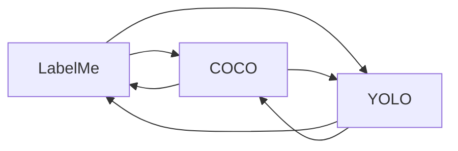

# DataFlow-CV Documentation

This directory contains detailed documentation for the file formats supported by DataFlow-CV.

## Format Documentation

- **[COCO Format](coco.md)** - JSON-based format for object detection
- **[LabelMe Format](labelme.md)** - JSON-based format with polygon/rectangle support
- **[YOLO Format](yolo.md)** - TXT-based format with normalized coordinates

## Format Comparison

| Feature | COCO | LabelMe | YOLO |
|---------|------|---------|------|
| **File Format** | JSON | JSON | Plain Text |
| **Extension** | `.json` | `.json` | `.txt` |
| **Coordinates** | `[x1, y1, w, h]` (pixels) | `[[x1, y1], [x2, y2]]` (pixels) | `[xc, yc, w, h]` (normalized) |
| **Class Names** | In JSON file | In JSON file | Separate `classes.txt` file |
| **Shape Types** | Bounding boxes only | Rectangles & polygons | Bounding boxes only |
| **Multiple Objects** | Yes | Yes | Yes |
| **Image Metadata** | In JSON file | In JSON file | Not stored |

## Conversion Matrix

DataFlow-CV supports conversion between all three formats:



## Quick Reference

### File Extensions
- **Images**: `.jpg`, `.jpeg`, `.png`, `.bmp`, `.tiff`
- **COCO annotations**: `.json`
- **LabelMe annotations**: `.json`
- **YOLO annotations**: `.txt`
- **YOLO class names**: `classes.txt`

### Coordinate Systems
- **COCO**: `[x1, y1, width, height]` (top-left corner, pixels)
- **LabelMe**: `[[x1, y1], [x2, y2]]` (rectangle corners, pixels)
- **YOLO**: `[xc, yc, width, height]` (center, normalized 0-1)

### CLI Commands

**Visualization:**
```bash
# COCO
dataflow visualize coco image.jpg annotation.json --show

# LabelMe
dataflow visualize labelme image.jpg annotation.json --show

# YOLO
dataflow visualize yolo image.jpg labels.txt classes.txt --show
```

**Conversion:**
```bash
# Between formats
dataflow convert <source>2<target> [arguments]

# Examples:
dataflow convert coco2yolo image.jpg annotation.json output.txt --class-names classes.txt
dataflow convert labelme2coco labelme.json output.json
dataflow convert yolo2labelme image.jpg labels.txt classes.txt output.json
```

## Best Practices

1. **Consistent naming**: Use the same class names across all annotations
2. **File organization**: Keep images and annotations in parallel directory structures
3. **Image dimensions**: Always include correct image width/height in annotations
4. **Normalization**: Ensure YOLO coordinates are properly normalized (0.0 to 1.0)
5. **Validation**: Use DataFlow-CV visualization to verify annotation correctness

## Troubleshooting

- **Missing files**: Ensure annotation files exist and paths are correct
- **Class mismatches**: Verify class names match between formats
- **Coordinate errors**: Check that coordinates are within image bounds
- **Format issues**: Use the examples in each format document as reference

## Additional Resources

- [Main README](../README.md) - Project overview and installation
- [CLAUDE.md](../CLAUDE.md) - Development guide and architecture
- [Examples](../examples/) - Code examples for conversion and visualization